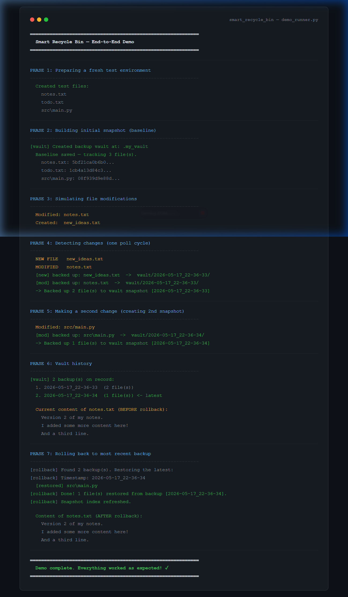
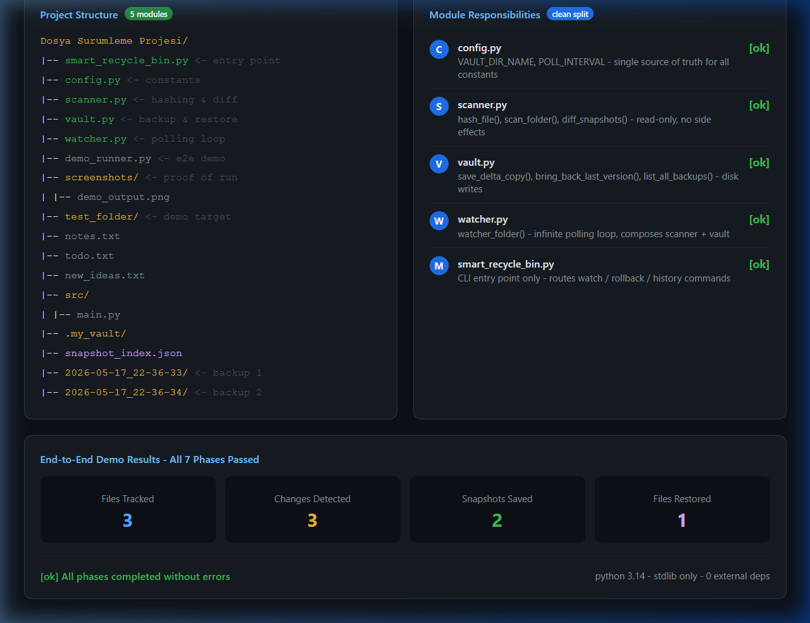

# Smart Recycle Bin 🗑️

A lightweight, command-line file versioning tool built entirely with Python's standard library. Think of it as a personal "smart recycle bin" — it silently watches a folder, saves timestamped backups of every change, and lets you roll back to any previous state with a single command.

> **Assignment**: File Versioning System — Computer Engineering, Year 3  
> **Language**: Python 3.x | **Dependencies**: None (stdlib only)

---

## 📁 Project Structure

```
smart-recycle-bin/
├── smart_recycle_bin.py   ← CLI entry point
├── config.py              ← constants (vault name, poll interval)
├── scanner.py             ← MD5 hashing & folder diff logic
├── vault.py               ← backup, restore, and index operations
├── watcher.py             ← polling loop that ties it all together
├── demo_runner.py         ← end-to-end proof-of-concept script
└── screenshots/           ← demo output screenshots
```

---

## 🚀 How to Use

No installation needed. Just Python 3.x.

### Start Watching a Folder
```bash
python smart_recycle_bin.py watch ./my_folder
```
This will:
- Create a hidden `.my_vault/` directory inside `my_folder`
- Take an initial MD5 fingerprint of every file (the baseline)
- Poll every 2 seconds and back up anything that changes

### Roll Back to the Last Backup
```bash
python smart_recycle_bin.py rollback ./my_folder
```
Finds the most recent timestamped snapshot in the vault and restores those files. Files not in the backup are left untouched.

### View Backup History
```bash
python smart_recycle_bin.py history ./my_folder
```
Lists all snapshots in the vault with timestamps and file counts.

---

## ⚙️ How It Works

```
                 ┌─────────────┐
 Ctrl+C ──────►  │  watcher.py  │  ◄── poll every 2s
                 └──────┬──────┘
                        │ calls
              ┌─────────▼─────────┐
              │    scanner.py      │  ← MD5 hash each file
              │  diff_snapshots()  │  ← compare with last run
              └─────────┬─────────┘
                        │ changed files
              ┌─────────▼─────────┐
              │     vault.py       │  ← copy to .my_vault/<timestamp>/
              │  save_delta_copy() │  ← update snapshot_index.json
              └────────────────────┘
```

Change detection is purely hash-based — if the MD5 of a file matches the stored hash, no backup is made. This keeps the vault lean even after many polls.

### Vault Layout
```
.my_vault/
├── snapshot_index.json          ← current state fingerprint (JSON)
├── 2026-05-17_14-30-22/        ← one folder per change event
│   └── notes.txt
└── 2026-05-17_14-31-05/
    ├── notes.txt
    └── src/main.py
```

---

## 🧪 Running the Demo

To see all phases (baseline → detect → backup → rollback) in one go:
```bash
python demo_runner.py
```

Expected output phases:
1. Prepare fresh test environment
2. Build initial MD5 baseline
3. Simulate file modifications
4. Detect changes + create vault snapshot
5. Make a second change → second snapshot
6. Display vault history
7. Rollback and verify restored content

---

## 📸 Screenshots

| Demo Terminal Output | Project Architecture |
|---|---|
|  |  |

---

## 📝 Notes

- The `.my_vault` directory is excluded from version control via `.gitignore`
- On Windows, the vault won't be visually hidden by the OS (dot-prefix is a Unix convention), but it's still excluded from monitoring
- MD5 is used for speed, not cryptographic security — it's purely a change-detection fingerprint
- Rollback is selective: only files present in the backup are restored, so newer untracked files stay untouched
